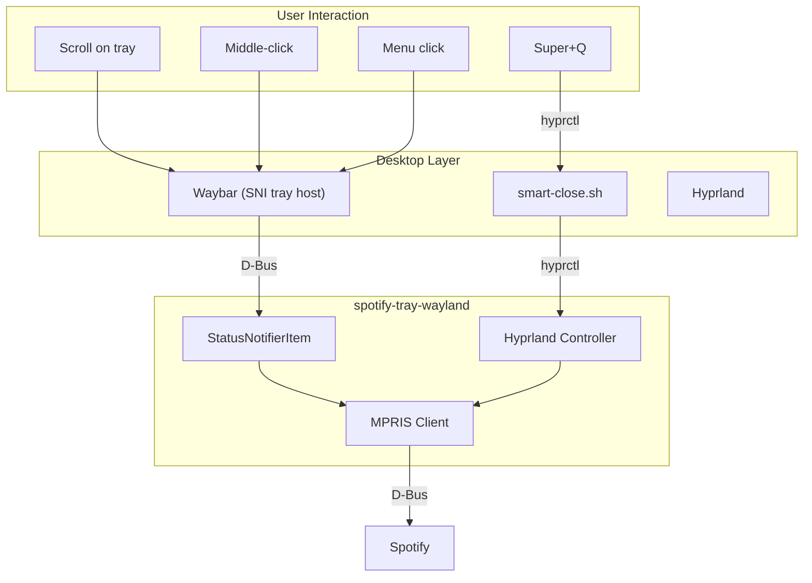

I wanted a simple thing: a **Spotify system tray icon** on my Wayland desktop. Click to show/hide the window, scroll to change tracks, middle-click to pause. Telegram does this. Discord does this. How hard could it be?

The answer: I needed to understand five different subsystems, fork a library, and find a clever workaround for what initially seemed impossible.

This is the story of building [**spotify-tray-wayland**](https://github.com/xander1421/spotify-tray-wayland), and a window into why Linux desktop integration remains challenging despite decades of standardization efforts.

## The Problem: No Spotify Tray on Wayland

If you've searched for "Spotify minimize to tray Wayland" or "Spotify system tray Hyprland," you've probably found the same frustration I did. The existing `spotify-tray` tool only works on X11. On Wayland, you're stuck with Spotify taking up a workspace or closing entirely when you hit Super+Q.

I wanted:
- **Minimize to tray** - hide Spotify without closing it
- **Scroll on icon** - next/previous track
- **Middle-click** - play/pause
- **Right-click menu** - full playback controls

Sounds straightforward. It wasn't.

## Going Down the Rabbit Hole

When I started this project, I had no idea how deep it would go. I thought I'd find a library, hook into Spotify, and be done in an evening.

Instead, I discovered that "system tray" on Linux means something completely different on Wayland than it did on X11. And that controlling Spotify requires understanding D-Bus. And that showing/hiding windows requires compositor-specific IPC. Each question led to another layer:

- "How do I make a tray icon?" → StatusNotifierItem specification
- "How do I control Spotify?" → D-Bus and MPRIS
- "How do I hide the window?" → Hyprland's IPC socket
- "Why doesn't scroll work?" → The library only implemented half the spec
- "Can I intercept Super+Q?" → Yes, by overriding the compositor keybind with a smart script

I went from "this should take a few hours" to reading Wayland protocol documentation, compositor source code, and D-Bus specifications. Without [Claude](https://claude.ai) helping me navigate these layers—explaining D-Bus object models, suggesting the special workspace approach for minimize-to-tray, and helping implement the StatusNotifierItem methods—I'd probably still be stuck reading freedesktop.org wikis.

## The Linux Desktop Fragmentation Problem

To build a Spotify tray icon that controls media playback on a Wayland compositor, you need to understand:

1. **Wayland** - The display protocol (but every compositor extends it differently)
2. **Your compositor's IPC** - Hyprland uses a custom Unix socket protocol
3. **D-Bus** - The desktop's inter-process communication system
4. **StatusNotifierItem** - The system tray specification
5. **MPRIS** - The media player control specification

Each of these is maintained by different groups, documented in different places, and implemented with varying levels of completeness. There's no single reference. You piece it together from freedesktop.org specs, compositor wikis, library source code, and Stack Overflow.

Compare this to macOS: `NSStatusItem` gives you a menu bar icon. `MPNowPlayingInfoCenter` handles media. One vendor, one API, done.

## Why X11 Spotify Tray Tools Don't Work on Wayland

On X11, system trays used the XEMBED protocol—applications literally embedded tiny windows into a tray container. Any app could also grab global hotkeys, read other windows, or inject input events. Powerful but fundamentally insecure.

Wayland changed everything. Each application is isolated:

- You can't enumerate other windows
- You can't intercept keypresses meant for other apps
- You can't embed windows into other applications
- You can't capture the screen without explicit permission

This breaks every X11-era Spotify tray tool, but the security trade-off is worth it. The problem is that replacement standards took years to mature, and adoption remains inconsistent.

## How spotify-tray-wayland Works

### Controlling Spotify with MPRIS and D-Bus

Spotify exposes media controls through MPRIS (Media Player Remote Interfacing Specification) over D-Bus. Every compliant player exports:

- `PlaybackStatus`: "Playing", "Paused", or "Stopped"
- `Metadata`: Artist, title, album art, duration
- Methods: `PlayPause()`, `Next()`, `Previous()`

```go
conn, _ := dbus.ConnectSessionBus()
obj := conn.Object("org.mpris.MediaPlayer2.spotify", "/org/mpris/MediaPlayer2")
obj.Call("org.mpris.MediaPlayer2.Player.PlayPause", 0)
```

This is one area where Linux standardization actually worked—most media players implement MPRIS.

### The System Tray: StatusNotifierItem

StatusNotifierItem (SNI) is the modern replacement for XEMBED system trays. Instead of embedding windows, apps register D-Bus objects describing their tray presence:

- Icon (by name or raw pixels)
- Tooltip text
- Menu structure
- Click handlers: `Activate()`, `SecondaryActivate()`, `ContextMenu()`, `Scroll()`

I used the `fyne.io/systray` Go library, but discovered scroll and middle-click were stubbed out—they returned "method not implemented" errors. I had to [fork the library](https://github.com/xander1421/systray) and implement these methods myself:

```go
func (s *statusNotifierItem) Scroll(delta int32, orientation string) *dbus.Error {
    if onScroll != nil && orientation == "vertical" {
        if delta > 0 {
            onScroll(ScrollUp)
        } else {
            onScroll(ScrollDown)
        }
    }
    return nil
}
```

This is typical: libraries implement 80% of a spec, and you discover the missing 20% when your feature doesn't work.

### Minimize to Tray on Hyprland

To show/hide Spotify's window, I talk directly to Hyprland through its IPC socket. Hyprland has "special workspaces"—hidden spaces that don't appear in workspace switchers:

```bash
# Hide Spotify
hyprctl dispatch movetoworkspacesilent special:spotify,address:0x55f3...

# Show Spotify
hyprctl dispatch movetoworkspacesilent e+0,address:0x55f3...
hyprctl dispatch focuswindow address:0x55f3...
```

Move the window to `special:spotify` to hide it, move it back to show it. The tray icon triggers these commands.

**Note:** This only works on Hyprland. Sway uses a different IPC protocol. GNOME doesn't expose window manipulation at all. That's the fragmentation problem in action.

### Solving the Super+Q Problem

Initially I thought intercepting Super+Q was impossible. When you press Super+Q with Spotify focused, Hyprland's default `killactive` binding runs before the keypress reaches the app. But that's actually the solution—we can override the keybind at the compositor level.

The trick is a **smart-close script** that checks which window is focused before deciding what to do:

```bash
#!/bin/bash
class=$(hyprctl activewindow | grep "class:" | cut -d' ' -f2)

if [[ "${class,,}" == "spotify" ]]; then
    hyprctl dispatch movetoworkspacesilent special:minimized
else
    hyprctl dispatch killactive
fi
```

The setup script auto-detects your existing close keybind by parsing your Hyprland config:

```bash
# Detect user's killactive keybind
killactive_line=$(grep -rh "killactive" "$HYPR_DIR" | grep -E "^bind" | head -1)
# Parse modifier and key, resolve $mainMod variable...
```

Then it generates a config that overrides your specific keybind:

```conf
# Auto-generated - your keybind may differ
unbind = SUPER, Q
bind = SUPER, Q, exec, ~/.config/hypr/UserScripts/smart-close.sh
```

Now your close keybind minimizes Spotify to the special workspace (tray behavior) while still killing other windows normally. The keybind runs at the compositor level, before any app sees the keypress—so Spotify never gets a chance to quit.

This approach works because Hyprland processes keybinds before forwarding events to applications. We're not intercepting keypresses meant for apps (which Wayland prevents), we're replacing the compositor's own keybind with smarter logic.

## The Architecture



The tray bridges three protocols: **StatusNotifierItem** for the tray icon, **MPRIS/D-Bus** for media control, and **hyprctl** for window management.

## Installation

### Arch Linux (AUR)

```bash
# Pre-built binary
yay -S spotify-tray-wayland-bin

# Or build from source
yay -S spotify-tray-wayland-git
```

Hyprland keybinds are configured automatically during installation, and cleaned up on uninstall.

### From Source

```bash
git clone https://github.com/xander1421/spotify-tray-wayland
cd spotify-tray-wayland
./setup.sh
```

The setup script detects your existing close keybind, installs the binary and smart-close script, creates a launcher that starts the tray with Spotify, and configures Hyprland keybinds automatically.

## Features

- **Super+Q**: Smart close—minimizes Spotify to tray, kills other windows
- **Left-click**: Show/hide Spotify window (minimize to tray)
- **Middle-click**: Play/pause
- **Scroll up**: Next track
- **Scroll down**: Previous track
- **Right-click menu**: Full playback controls, quit option
- **Tooltip**: Shows current track and playback status
- **Auto-restore**: If Spotify was hidden when the tray starts, it automatically shows it
- **Clean quit**: Pauses playback, closes window gracefully, then terminates

## Conclusion

Building this tool required diving through layers I didn't know existed when I started. The Linux desktop's strength—choice and flexibility—is also its weakness. Every compositor does IPC differently. Libraries implement specs partially. Documentation is scattered across wikis, specs, and source code.

But it works now—including Super+Q minimize-to-tray, which I initially thought was impossible. The solution came from realizing that compositor keybinds run *before* apps receive keypresses. By replacing Hyprland's default `killactive` with a script that checks the focused window class, we get the exact behavior Windows and macOS users expect: close everything except Spotify, which minimizes to tray.

If you're on Hyprland and want a proper **Spotify system tray** with **minimize to tray** functionality, give [spotify-tray-wayland](https://github.com/xander1421/spotify-tray-wayland) a try.

---

*Licensed under GPL-3.0. Contributions welcome.*
