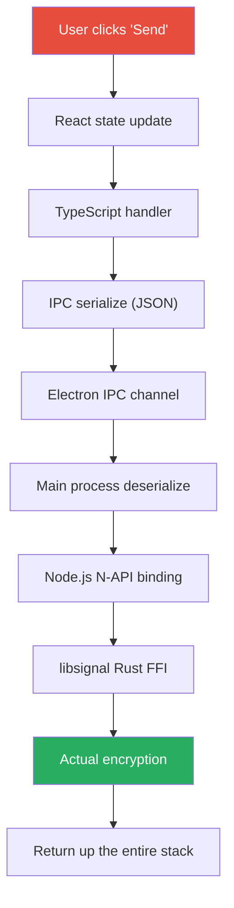
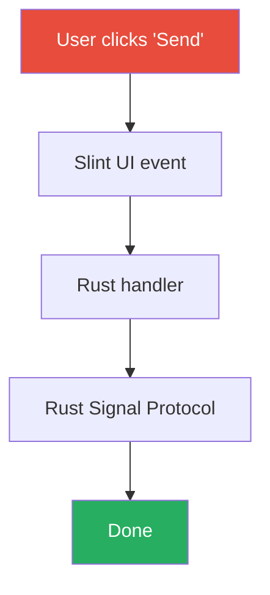

I built the same chat app three times. Each iteration taught me something the previous one couldn't: that every layer between your code and the hardware is a layer of problems.

This is the story of building [Chatter](https://github.com/xander1421/chatter), a secure messaging app with Signal Protocol encryption, and why I finally landed on native Rust after trying React, Electron, and Flutter.

## Version 1: React in the Browser

I started where most developers start—the browser. React, TypeScript, a modern stack. The UI came together quickly. Hot reload. Component libraries. The JavaScript ecosystem's instant gratification.

Then I tried to implement Signal Protocol.

```typescript
// What I wanted to do
import { SignalProtocolStore } from '@aspect/signal-protocol';
const session = await SessionCipher.encryptMessage(recipientId, plaintext);
```

The problem: Signal's reference implementation (`libsignal`) is written in Rust with bindings for Java, Swift, and Node.js. **Not for browsers.**

Why? Cryptographic operations require:
- Secure random number generation (`crypto.getRandomValues` has limitations)
- Protected memory (JavaScript's garbage collector can leave secrets in memory)
- Constant-time operations (JS JIT optimizers break timing guarantees)
- Access to system keychain (browsers are sandboxed)

I could use WebCrypto for basic operations, but Signal Protocol needs X3DH key agreement, Double Ratchet, sealed sender certificates—a full cryptographic stack that doesn't exist in browser-safe JavaScript.

**Lesson 1:** The browser sandbox that protects users also limits what you can build.

## Version 2: Electron Wrapper

The obvious solution: wrap React in Electron. Now I had Node.js, which has `@aspect/libsignal-client` bindings. Problem solved?

Not quite.

### The IPC Bridge Problem

Electron runs two processes: the **main process** (Node.js, full system access) and the **renderer process** (Chromium, sandboxed). They communicate through IPC (Inter-Process Communication).

Every operation that touches libsignal or the system requires an IPC call:

```javascript
// preload.cjs - 401 lines of bridge code
contextBridge.exposeInMainWorld('electronAPI', {
  signal: {
    initializeMessageDatabase: (userId) => ipcRenderer.invoke('signal:initializeMessageDatabase', userId),
    storeMessage: (data) => ipcRenderer.invoke('signal:storeMessage', data),
    getMessage: (messageId) => ipcRenderer.invoke('signal:getMessage', messageId),
    encryptMessage: (data) => ipcRenderer.invoke('signal:encryptMessage', data),
    decryptMessage: (data) => ipcRenderer.invoke('signal:decryptMessage', data),
    // ... 50+ more methods
  },
  notifications: { /* more IPC */ },
  ollama: { /* more IPC */ },
  models: { /* more IPC */ },
});
```

```javascript
// electron.cjs - 1,130 lines of handlers
ipcMain.handle('signal:encryptMessage', async (event, data) => {
  // Deserialize from renderer
  // Call libsignal
  // Serialize result
  // Return to renderer
});
```

**1,531 lines of glue code** just to bridge two processes in the same application.

### The Layer Cake

Here's what happens when a user sends a message in the Electron version:



Eight layers. JSON serialization at every IPC boundary. The renderer can't directly call Rust—it goes through JavaScript bindings, through Node, through IPC, through React.

### Wayland Pain

Then there's Wayland. Electron is built on Chromium, and Chromium's Linux support assumes X11. On Wayland, I needed:

```javascript
// electron.cjs - Platform detection gymnastics
const isWayland = process.platform === 'linux' &&
  (process.env.XDG_SESSION_TYPE === 'wayland' || Boolean(process.env.WAYLAND_DISPLAY));

if (isWayland) {
  app.commandLine.appendSwitch('enable-features', 'WebRTCPipeWireCapturer');
  app.commandLine.appendSwitch('disable-features', 'WaylandWpColorManagerV1');
  app.commandLine.appendSwitch('ozone-platform-hint', 'auto');
}

// Force libsecret for keychain on non-GNOME desktops
if (process.platform === 'linux' && app.isPackaged) {
  app.commandLine.appendSwitch('password-store', 'gnome-libsecret');
}
```

Electron doesn't recognize Hyprland or Sway as valid desktops. Screen sharing requires PipeWire flags. Color management breaks on some compositors. Every Chromium update brings new workarounds.

### The Numbers

| Metric | Electron Version |
|--------|------------------|
| `node_modules` | 1.5 GB |
| Dependencies | 2,000+ packages |
| TypeScript code | 139,000 lines |
| IPC bridge code | 1,531 lines |
| Processes at runtime | 5-10 |
| RAM usage | 500 MB - 1.5 GB |
| Startup time | 2-5 seconds |

**Lesson 2:** Electron gives you desktop access, but at the cost of running a browser engine for your UI.

## Version 3: Flutter

Flutter promised a better path: compiled to native code, single codebase for mobile and desktop, direct access to platform APIs through plugins.

```dart
// main.dart - Clean start
import 'package:libsignal/libsignal.dart';

void main() async {
  await LibSignal.init();  // Rust FFI, no IPC!
  runApp(const ChatterApp());
}
```

The architecture was cleaner. libsignal could be called directly through Dart FFI to Rust. No IPC serialization. No Node.js middle layer.

But then I ran it on my Hyprland desktop.

### Flutter's Linux Desktop Limitations

Flutter uses its own rendering engine (Skia/Impeller) and its own windowing abstraction. On Linux desktop, this means:

- **No system theme integration** - GTK/Qt themes don't apply, the app looks out of place
- **Limited compositor features** - No access to Hyprland's workspace IPC, layer shell, etc.
- **Separate ecosystem** - Platform integrations require plugins that may or may not exist

Flutter works great for mobile. On Linux desktops, especially tiling window managers like Hyprland, it feels like a mobile app running on desktop.

**Lesson 3:** Flutter is excellent for mobile, but Linux desktop isn't its priority.

## Version 4: Native Rust

Three failed attempts taught me what I needed:

1. **Direct hardware access** - No IPC, no bridges, no VMs
2. **Native Wayland support** - First-class, not bolted on
3. **Signal Protocol in-process** - Rust calling Rust, no FFI overhead
4. **Single codebase, all platforms** - But truly native on each

The answer was staring at me the whole time. libsignal is written in Rust. My backend is Go. The only reason I used TypeScript and Dart was familiarity.

### The Slint Stack

I chose [Slint](https://slint.dev) for the UI—a Rust-native GUI framework that compiles to native code on every platform:

```toml
[dependencies]
slint = "1.9"
tokio = { version = "1", features = ["full"] }
tonic = { version = "0.12", features = ["tls"] }
rusqlite = { version = "0.32", features = ["bundled-sqlcipher"] }

# Signal Protocol - Pure Rust
x25519-dalek = "2"
ed25519-dalek = "2"
aes-gcm = "0.10"
```

Here's the same message encryption flow in native Rust:



Four layers. No serialization. No IPC. No JavaScript.

### What the Code Looks Like

```rust
// One language, one file, direct crypto access
async fn send_message(&self, recipient: &str, plaintext: &[u8]) -> Result<()> {
    // Direct call - no IPC, no serialization
    let session = self.signal_store.load_session(recipient).await?;
    let ciphertext = session.encrypt(plaintext)?;

    // gRPC to server - Rust tonic, not JS fetch
    self.client.send_message(SendRequest {
        recipient_id: recipient.into(),
        ciphertext: ciphertext.into(),
    }).await?;

    Ok(())
}
```

```slint
// ui/chat.slint - Declarative, hot-reloadable
export component MessageInput {
    callback send(string);

    HorizontalLayout {
        input := TextInput {
            placeholder: "Type a message...";
        }
        Button {
            text: "Send";
            clicked => { send(input.text); input.text = ""; }
        }
    }
}
```

### The Numbers

| Metric | Electron | Flutter | Rust + Slint |
|--------|----------|---------|--------------|
| Dependencies size | 1.5 GB | 500 MB | ~50 MB |
| Runtime processes | 5-10 | 1 | 1 |
| RAM usage | 500MB-1.5GB | 200-400 MB | 50-150 MB |
| Startup time | 2-5 sec | 1-2 sec | <1 sec |
| Wayland support | Workarounds | Partial | Native |
| Mobile support | No | Yes | Yes |
| NPU/ML access | Via Node | Via plugins | Direct |

### One Codebase, All Platforms

The same Rust code compiles to:

```bash
cargo build --release                              # Linux
cargo build --release --target x86_64-apple-darwin # macOS
cargo build --release --target x86_64-pc-windows   # Windows
cargo apk build --release                          # Android
cargo build --release --target aarch64-apple-ios   # iOS
```

And because it's native, I get:
- **NPU access** on mobile (ONNX Runtime with CoreML/NNAPI backends)
- **Direct D-Bus** for desktop integration (notifications, tray icons)
- **System keychain** through native APIs, not Electron workarounds
- **Native Wayland** through Slint's winit backend

### The Security Argument

For a secure messaging app, the language matters. Rust's guarantees aren't just nice-to-have:

| Vulnerability Class | TypeScript/Dart | Rust |
|---------------------|-----------------|------|
| Buffer overflow | Possible | Compile-time prevented |
| Use-after-free | GC hides it | Compile-time prevented |
| Data races | Runtime crash | Compile-time prevented |
| Null pointer | Runtime crash | `Option<T>` enforced |
| Memory secrets | GC may retain | Explicit zeroization |

When your app handles encryption keys, "the runtime usually catches it" isn't good enough.

### The Trade-offs

Rust isn't free. The costs are real:

- **Steep learning curve** - Ownership, lifetimes, and the borrow checker take time to internalize
- **Slower iteration** - Compile times are longer than Go or TypeScript (45+ seconds for full builds)
- **Smaller UI ecosystem** - Fewer ready-made components compared to React or Flutter
- **Slint licensing** - GPL-3.0 free tier means your app must also be GPL (commercial license available)

For Chatter, these trade-offs made sense—security matters more than iteration speed for a messaging app. For a CRUD app or MVP, they might not.

## The Real Lesson

Each rewrite taught me something:

1. **React/Browser** → Security and system access have hard limits
2. **Electron** → Layers have costs that compound
3. **Flutter** → Great for mobile, but desktop feels like an afterthought
4. **Rust** → Native isn't harder, it's different

The irony: I spent more time managing Electron's IPC complexity than learning Rust basics.

The Rust version has:
- **No bridge code** (no IPC glue between processes)
- **Fewer dependencies** (no npm, no pub.dev)
- **Fewer bugs** (the compiler catches entire categories)
- **Better performance** (no interpretation, no GC)
- **True portability** (native on each platform, not emulated)

## Advice for New Projects

If I were starting today:

1. **For a web app**: Use the browser. Accept its limits.
2. **For a desktop app on one platform**: Use native (Swift/Kotlin/Rust).
3. **For a cross-platform desktop app**: Rust + Slint or Tauri.
4. **For mobile**: Native (Swift/Kotlin) or Flutter if you must.
5. **For desktop + mobile from one codebase**: Rust + Slint.
6. **For anything involving cryptography**: Rust.

The JavaScript ecosystem's convenience is real, but so is its ceiling. When you hit that ceiling, you don't optimize your way out—you rebuild with fewer layers.

## What's Next

Chatter is now being built in Rust with Slint. The same codebase will run on:
- Linux (native Wayland)
- macOS
- Windows
- Android
- iOS

With Signal Protocol encryption, on-device AI (users can download their own models), and proper system integration on each platform.

It took three rewrites to learn that native isn't the hard path—it's the honest one. Every abstraction promises to save time and costs it back somewhere else. Rust and Slint cost time upfront in learning, then pay it back in every feature that just works.

---

*The Chatter client is open source under GPL-3.0.*
