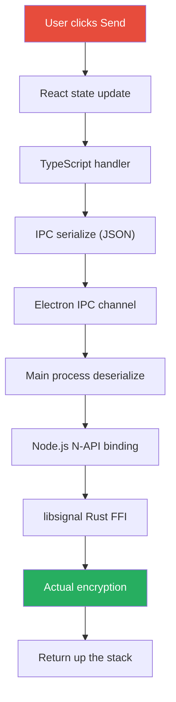
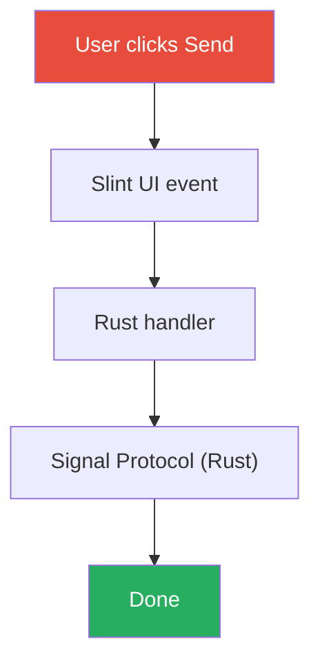

I'm building [Chatter](https://github.com/xander1421/chatter), a secure messaging app with Signal Protocol encryption. I've now started the client three times in three different stacks. This isn't a story about finding the "best" technology—it's about discovering what matters when you're actually building something.

## Why Not Just Use the Browser?

I started thinking about this project as a web app. React, TypeScript, modern tooling. But Signal Protocol has requirements that browsers can't satisfy:

- **Secure random number generation** - `crypto.getRandomValues` has limitations for cryptographic use
- **Protected memory** - JavaScript's garbage collector can leave secrets in memory
- **Constant-time operations** - JS JIT optimizers can break timing guarantees
- **System keychain access** - Browsers are sandboxed from OS credential storage

Signal's reference implementation (`libsignal`) is written in Rust with bindings for Java, Swift, and Node.js—not browsers. The browser sandbox that protects users also limits what you can build.

## Starting with What I Knew: React + Electron

So I went with Electron. Now I had Node.js, which has `@signalapp/libsignal-client` bindings. The UI came together quickly using React.

Electron worked. I got Signal Protocol encryption running. The app functioned.

But with each feature I added, the app felt heavier. Not dramatically—just a little slower to start, a little more sluggish. The kind of thing you rationalize as "development mode overhead."

### The IPC Bridge Problem

Electron runs two processes: the **main process** (Node.js, full system access) and the **renderer process** (Chromium, sandboxed). They communicate through IPC.

Every call to libsignal, every database query, every system notification requires serialization:

```javascript
// preload.cjs - 401 lines of bridge code
contextBridge.exposeInMainWorld('electronAPI', {
  signal: {
    encryptMessage: (data) => ipcRenderer.invoke('signal:encryptMessage', data),
    decryptMessage: (data) => ipcRenderer.invoke('signal:decryptMessage', data),
    // ... 50+ more methods
  },
  notifications: { /* more IPC */ },
  database: { /* more IPC */ },
});
```

```javascript
// electron.cjs - 1,130 lines of handlers
ipcMain.handle('signal:encryptMessage', async (event, data) => {
  // Deserialize from renderer
  // Call libsignal
  // Serialize result
  // Return to renderer
});
```

**1,531 lines of glue code** that does nothing except shuttle data between processes.

### The Layer Cake

Here's what happens when a user sends a message in Electron:



Eight layers. JSON serialization at every IPC boundary.

### Wayland Workarounds

On my Hyprland setup, Electron needed special handling:

```javascript
// electron.cjs - Platform detection
const isWayland = process.platform === 'linux' &&
  (process.env.XDG_SESSION_TYPE === 'wayland' ||
   Boolean(process.env.WAYLAND_DISPLAY));

if (isWayland) {
  app.commandLine.appendSwitch('enable-features', 'WebRTCPipeWireCapturer');
  app.commandLine.appendSwitch('disable-features', 'WaylandWpColorManagerV1');
  app.commandLine.appendSwitch('ozone-platform-hint', 'auto');
}

// Force libsecret for keychain on non-GNOME desktops
if (process.platform === 'linux' && app.isPackaged) {
  app.commandLine.appendSwitch('password-store', 'gnome-libsecret');
}
```

Electron is built on Chromium, which assumes X11. Every Chromium update can bring new workarounds.

### The Numbers

| What | Size |
|------|------|
| `node_modules` | 1.5 GB |
| IPC bridge code | 1,531 lines |

## Trying Flutter: The X11 Realization

I wanted something that compiled to native code. Flutter promised that—single codebase, native performance, mobile support. I started rebuilding.

Then I noticed something while debugging on my Hyprland setup. The app was running under XWayland, not native Wayland. Flutter was falling back to X11 compatibility mode.

This wasn't a bug I could fix. It was just how Flutter worked on Linux at the time. The framework I chose for "native" performance was running through a compatibility layer.

That realization—that I was adding abstraction layers without even knowing it—made me stop mid-development on the Flutter version.

## Why Rust

The argument for Rust wasn't primarily about performance. It was about two things:

### 1. One Language, No Bridges

libsignal is written in Rust. With Rust, I can call Signal Protocol functions directly—no FFI overhead, no serialization, no 1,531 lines of bridge code.

Here's message encryption in the Rust version:



Four layers instead of eight. No serialization boundaries.

### 2. The Compiler Catches Things Others Don't

Rust prevents entire categories of bugs at compile time:

| Issue | TypeScript/Dart | Rust |
|-------|-----------------|------|
| Null pointer | Runtime crash | `Option<T>` - must handle explicitly |
| Data races | Runtime crash (maybe) | Won't compile |
| Use-after-free | GC usually handles it | Won't compile |
| Buffer overflow | Possible | Won't compile |
| Memory leaks | GC may retain secrets | Explicit control |

For a messaging app handling encryption keys, "the runtime usually catches it" isn't reassuring.

### What the Code Looks Like

I chose [Slint](https://slint.dev) for the UI—a Rust-native GUI framework:

```toml
# Cargo.toml
[dependencies]
slint = "1.9"
tokio = { version = "1", features = ["full"] }
tonic = { version = "0.12", features = ["tls"] }
rusqlite = { version = "0.32", features = ["bundled-sqlcipher"] }

# Signal Protocol - Pure Rust
x25519-dalek = "2"
ed25519-dalek = "2"
aes-gcm = "0.10"
```

```rust
// One language, direct crypto access
async fn send_message(&self, recipient: &str, plaintext: &[u8]) -> Result<()> {
    let session = self.signal_store.load_session(recipient).await?;
    let ciphertext = session.encrypt(plaintext)?;

    self.client.send_message(SendRequest {
        recipient_id: recipient.into(),
        ciphertext: ciphertext.into(),
    }).await?;

    Ok(())
}
```

```slint
// ui/app.slint - Declarative UI
global Theme {
    out property <color> background: #1a1a2e;
    out property <color> primary: #4f46e5;
    out property <color> text: #f8fafc;
}

export struct MessageData {
    id: string,
    author-name: string,
    content: string,
    timestamp: string,
    is-own: bool,
}
```

### Cross-Platform Compilation

Rust compiles to native code on each platform:

```bash
cargo build --release                              # Linux
cargo build --release --target x86_64-apple-darwin # macOS
cargo build --release --target x86_64-pc-windows   # Windows
cargo apk build --release                          # Android
cargo build --release --target aarch64-apple-ios   # iOS
```

Currently I'm developing on Linux. Mobile builds are planned but not yet tested.

## The Real-World Experience

### Fewer Layers, Better Focus

With Electron, I was constantly context-switching: React components, TypeScript handlers, IPC serialization, Node.js handlers, native bindings. Five mental models for one feature.

With Rust + Slint, it's two: the UI markup and Rust code. When something breaks, there's one place to look. When I add a feature, I write it once. The cognitive load is genuinely lower despite Rust being a "harder" language.

### Development vs Runtime Trade-off

Rust shifts the cost from runtime to compile time—and from users to developers:

| | Development | User's Machine |
|---|-------------|----------------|
| **Electron** | Fast iteration, any laptop works | Ships browser engine, high RAM |
| **Rust** | Slower builds, needs decent CPU | 11 MB binary, minimal RAM |

My development machine needs good hardware for reasonable compile times. But users get a lightweight app that doesn't ship a browser engine. That trade-off feels right—I have a fast machine, my users might not.

### The Coding Experience

Rust's strictness is polarizing, but for me it's become a better experience:

- **No null pointer surprises** - If it compiles, `Option<T>` is handled
- **No "works on my machine"** - The type system catches platform differences
- **Refactoring confidence** - Change a type, compiler shows every place that breaks
- **Fewer runtime bugs** - Problems surface at compile time, not in production

The borrow checker is annoying until you internalize it. Then it's like having a code reviewer who catches memory bugs before you commit.

## The Trade-offs

Rust isn't free:

- **Learning curve** - Ownership and borrowing take time to internalize
- **Hardware requirements** - Compile times need decent CPU; my builds take 45+ seconds
- **Slower iteration** - Hot reload doesn't exist like in React/Flutter
- **Smaller UI ecosystem** - Fewer ready-made components than React or Flutter
- **Slint licensing** - GPL-3.0 free tier means your app must also be GPL (commercial license available)

The Rust client is still in development. I can't claim it's "better" because it's not finished. What I can say is that the problems I'm solving now are different—they're about application logic, not bridging between layers.

## What I Learned

Each version taught me something:

1. **Browser** - The sandbox protects users but limits what you can build. Signal Protocol needs things browsers can't provide.

2. **Electron** - Abstractions have weight. IPC isn't free. 1,531 lines of bridge code is 1,531 lines that can have bugs, and every message goes through eight layers.

3. **Flutter** - "Cross-platform" can mean "compatibility layer you didn't know about." I was debugging my app thinking issues were Wayland-related, only to discover Flutter was running through X11 the whole time.

4. **Rust** - The compiler is strict because it's catching real problems. Fighting the borrow checker is frustrating until you realize it just prevented a data race in your encryption code.

## For Anyone Starting a Similar Project

- **If you know the web stack**: Electron works. Just understand you're shipping a browser engine and maintaining IPC bridges.
- **If you need mobile + desktop**: Flutter is mature for mobile. Check its actual behavior on your target desktop platform.
- **If you're handling sensitive data**: Consider what guarantees you need. Rust's strictness is a feature when security matters.
- **If you're already fighting your tools**: That's a signal. The "sunk cost" of switching might be less than the ongoing cost of fighting.

I'm not done building Chatter. The Rust version is in progress. But I'm no longer debugging IPC serialization or wondering why my "native" app is running through X11. The problems I have now are the problems I actually want to solve.

---

*Chatter is open source under GPL-3.0. Development continues.*
