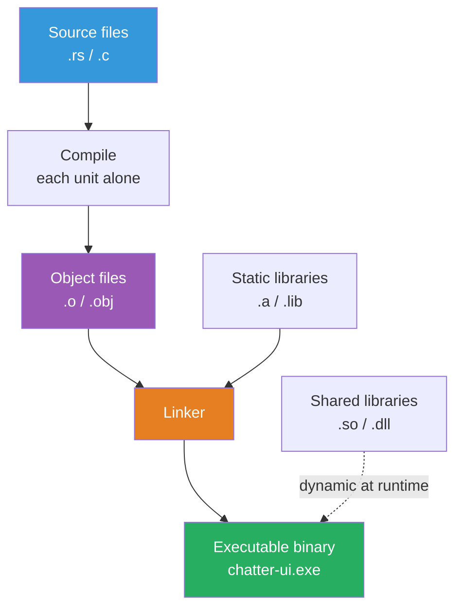
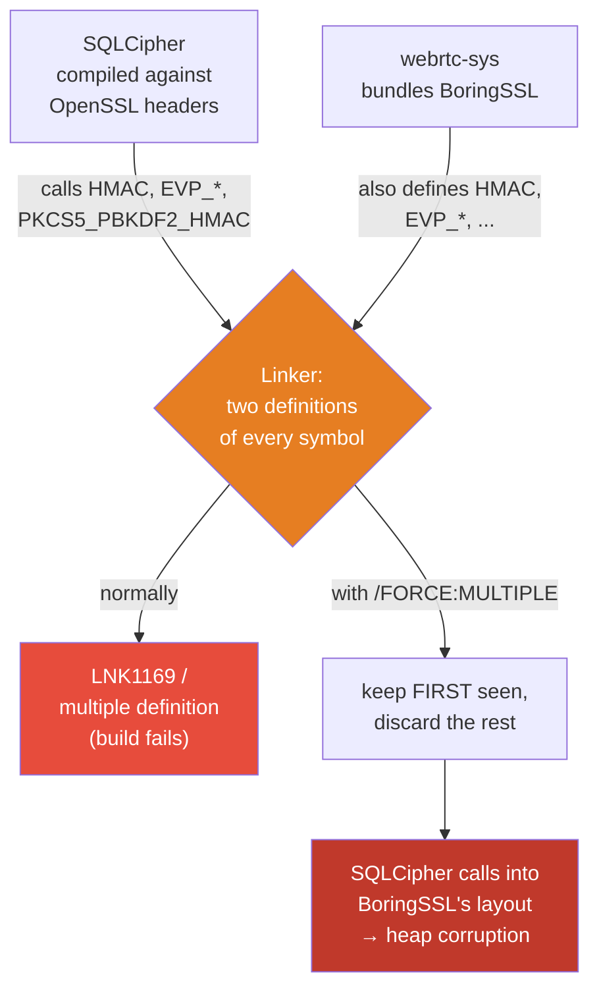

I'm building [Chatter](https://github.com/xander1421/chatter), an end-to-end encrypted chat app. The desktop client is Rust. One day the Windows build started dying on startup with no error message—no Rust panic, no stack trace, just gone. The exit code was `-1073741819`, which is `0xC0000005`: a Windows access violation. A native memory crash, happening below my Rust code, in C I never wrote.

The bug turned out to be a linking problem: two separate C crypto libraries got welded into one binary, both claiming the same function names. To understand why that corrupts memory—and why the fix is what it is—I had to actually understand how `cargo build` turns source code into a binary, and where C fits into that. This post is that journey, from "what is a symbol" up to the actual fix.

## The Symptom

The last log line before the process vanished:

```
INFO chatter_core::app::infrastructure: Verified: passphrase successfully stored and retrievable
```

Then nothing. With an existing database it would *hang*; with a fresh one it would *exit*. Either way it never reached the next step—running migrations on the encrypted database.

`RUST_LOG=trace` added nothing past that line. That's the tell: if a Rust program fails, you get `panicked at ...` with a location. The *absence* of a panic line means the crash happened in native code, beneath Rust, where the panic machinery can't reach. Something in C scribbled over memory it didn't own.

The crash sat right on the first real cryptographic operation: opening the SQLCipher database with `PRAGMA key`, which runs PBKDF2 to derive the encryption key. To see why a key-derivation call corrupts memory, you need to know what the compiler and linker did to get there.

## How Source Code Becomes a Binary

We say "compile," but compiling a program is really several distinct stages. Most of the time cargo (or gcc, or MSVC) hides them behind one command. They matter here, so let's pull them apart.



**1. Compilation.** Each source file is compiled *on its own*, with no knowledge of any other file. The compiler translates it to machine code and emits an **object file** (`.o` on Linux, `.obj` on Windows). When the file references something defined elsewhere—`memcpy`, another function, a global—the compiler can't fill in the address. It doesn't know where that thing will live yet. So it leaves a hole and writes down a note: "there's an unresolved reference to a thing named `memcpy` here, patch it later."

**2. Symbols.** That "name" is a **symbol**. A symbol is just a label attached to an address—a function or a piece of data. Each object file carries a symbol table with two kinds of entries:

- **Defined (exported):** "I contain `HMAC`, here it is."
- **Undefined (imported):** "I *use* `HMAC`, somebody please provide it."

A symbol is the only thing connecting one object file to another. Names are the glue. Hold that thought—it's the entire bug.

**3. Linking.** The **linker** takes all the object files plus any libraries, builds one big symbol table, and plays matchmaker: every undefined symbol gets connected to the one object that defines it. It patches the holes with real addresses and writes out the final binary. If two objects each export a symbol with the *same name*, that's a conflict—the linker doesn't know which one the callers meant. That conflict is the crash.

### Static vs. dynamic libraries

A **library** is just a bundle of pre-compiled object files. Two flavors, and the difference matters for this bug:

- **Static** (`.a` on Linux, `.lib` on Windows): the linker copies the object code it needs straight *into* your binary at link time. Self-contained, bigger file, no runtime dependency.
- **Dynamic / shared** (`.so`, `.dll`, `.dylib`): not copied in. The binary just records "I need `libcrypto.so` at runtime," and the OS loads and links it when the program starts.

Both crypto libraries in my app are *statically* linked. They get baked into the executable. That's important: with dynamic linking each `.so` keeps its own namespace and you can sometimes dodge collisions. Static linking dumps everything into one flat pile of symbols, and a flat pile is exactly where same-named symbols collide.

## Where C Comes In: Rust's FFI and `-sys` Crates

Rust links against C constantly, usually without you noticing. The mechanism is the **FFI** (Foreign Function Interface): Rust can call a C function if you declare its signature in an `extern "C"` block, and the linker resolves that declaration to a real C symbol—same matchmaking as above, across language lines.

```rust
extern "C" {
    // Rust promises this exists somewhere; the linker must find a C
    // symbol literally named "PKCS5_PBKDF2_HMAC".
    fn PKCS5_PBKDF2_HMAC(/* ... */) -> i32;
}
```

This works because of one crucial asymmetry between C and Rust symbol names:

- **Rust mangles names.** A Rust function `encrypt` in module `crypto` becomes something like `_ZN6crypto7encrypt17h...E`—the compiler encodes the module path and a type hash into the symbol. Two different `encrypt` functions get different mangled names, so they never collide.
- **C does not mangle.** A C function called `HMAC` produces a symbol called *exactly* `HMAC`. Flat, global, no namespace. That's how the FFI can find it by name—and also why two C libraries that both define `HMAC` are on a collision course.

By convention, Rust wraps a C library in a **`-sys` crate**: a thin crate whose only job is to build and/or link the C code and expose its raw symbols. Its `build.rs` (a build script that runs *before* the crate compiles) drives a C compiler or points the linker at a prebuilt library. In my dependency tree:

- **`rusqlite`** with the `bundled-sqlcipher` feature pulls in `libsqlite3-sys`, whose `build.rs` compiles **SQLCipher** (encrypted SQLite) from C source and links it against a `libcrypto`—which crypto provider it gets is controlled by `OPENSSL_*` environment variables.
- **`livekit`** (voice/video calls) pulls in **`webrtc-sys`**, which downloads a *prebuilt* static `libwebrtc` with **BoringSSL statically welded inside it**. No compile step, no feature flag for the crypto backend—it's baked in.

Two `-sys` crates, two C crypto libraries, headed for the same binary.

## The Collision

Here's the heart of it. **BoringSSL is Google's fork of OpenSSL.** Because it's a fork, it kept the public API: both libraries export the same function names—`EVP_*`, `HMAC`, `PKCS5_PBKDF2_HMAC`, `AES_*`, and the rest. Same names, same flat C namespace.

But a fork *diverges*. The two libraries lay out their internal structs differently, behave differently in spots, and are not ABI-compatible. The name `EVP_CIPHER_CTX` means one memory layout in OpenSSL and a different one in BoringSSL.

So the linker hits a wall:

```
MSVC:           LNK1169: one or more multiply defined symbols found
Linux (mold):   multiple definition of `EVP_DigestInit'
```

Both static libraries define `HMAC`. The linker can't pick. It refuses.



### The "fix" that caused the crash

The repo's original workaround was to tell the linker to stop complaining:

```toml
# .cargo/config.toml
[target.x86_64-pc-windows-msvc]
rustflags = ["-C", "link-arg=/FORCE:MULTIPLE"]

[target.x86_64-unknown-linux-gnu]
rustflags = ["-C", "link-arg=-Wl,--allow-multiple-definition"]
```

Read what those flags actually *do*: "if you see a duplicate symbol, keep the **first** definition you encounter and silently throw the rest away." The build goes green. The duplicate-symbol error disappears. The problem does not.

Because now *which* implementation every caller gets is decided by **link order**—the order the linker happens to process the libraries. In my build, OpenSSL came first, so every reference to `HMAC`, `EVP_*`, `PKCS5_PBKDF2_HMAC` across the *whole binary* resolved to OpenSSL's implementation. Including SQLCipher's calls. But SQLCipher was *compiled against OpenSSL's headers and ABI*... so on the path that was fine, and BoringSSL's copies got dropped.

On Windows the order flipped. SQLCipher—compiled expecting OpenSSL's struct layouts—had its crypto calls resolved to **BoringSSL's** implementation instead. It would set up a context assuming OpenSSL's memory layout, hand it to a function that interpreted those bytes as BoringSSL's layout, and the two disagree about where fields live and how big the struct is. The function wrote past where SQLCipher expected. **Heap corruption.** And it detonated on the very first crypto call: PBKDF2 inside `PRAGMA key`, opening the database. Native crash, `0xC0000005`, no Rust panic—exactly the symptom.

The original code comment had assumed BoringSSL "only runs inside WebRTC's DTLS/SRTP and doesn't share state" with the rest. That assumption was wrong: SQLCipher reaches for the *same symbol names*, so the two absolutely overlap. `/FORCE:MULTIPLE` wasn't fixing the collision—it was hiding it and rolling dice on link order.

## The Real Fix: One libcrypto, Not Two

You can't make two libraries that export identical symbols coexist in one flat-namespace static binary and have each call its *own* copy—not without rewriting symbol names in prebuilt artifacts (`objcopy --redefine-syms`, a version script, symbol localizing), which means rebuilding webrtc from source. The prebuilt `libwebrtc` ships with unprefixed symbols and no build step to flag. That door is closed.

So the answer is to stop shipping two cryptos. Have exactly **one** `libcrypto` in the binary and there's nothing to collide. Since webrtc's BoringSSL is the immovable one (prebuilt, can't swap it), the move is to point SQLCipher at *that same BoringSSL* instead of giving it a separate OpenSSL.

SQLCipher 4.5.x is BoringSSL-compatible, so this actually works. The `OPENSSL_*` environment variables that `libsqlite3-sys`'s `build.rs` reads let me redirect which crypto SQLCipher links against. On Windows (from `build-windows.ps1`):

```powershell
# Find webrtc's prebuilt lib + BoringSSL headers that webrtc-sys downloaded
$webrtcLib = Get-ChildItem -Path $env:CARGO_TARGET_DIR -Recurse -Filter webrtc.lib ...
$bsslInc   = Get-ChildItem -Path $env:CARGO_TARGET_DIR -Recurse -Directory ...
            | Where-Object FullName -match 'boringssl[\\/]src[\\/]include$' ...

$stage = "$env:CARGO_TARGET_DIR\boringssl-sqlcipher"
Copy-Item $webrtcLib.FullName "$stage\lib\libcrypto.lib"   # -lcrypto -> BoringSSL

# Point SQLCipher's build at BoringSSL instead of vcpkg OpenSSL
$env:OPENSSL_DIR         = $stage
$env:OPENSSL_LIB_DIR     = "$stage\lib"
$env:OPENSSL_INCLUDE_DIR = $bsslInc.FullName
$env:OPENSSL_STATIC      = "1"
```

Now SQLCipher is compiled *against* BoringSSL's headers and links *to* BoringSSL's code. The whole binary has one `libcrypto`. The struct layout SQLCipher expects and the one it calls into are the same. No collision, no corruption, no roulette—and calls plus an encrypted database live in the same build, which was the whole point.

The Android build does the identical thing (`android/build-android.sh` → `setup_boringssl_for_sqlcipher`), which is why Android never had the bug: it had been unified on one libcrypto from the start. Only the Windows path still had the separate vcpkg OpenSSL.

### The one extra Windows landmine: `wincrypt.h`

Unifying surfaced a second, smaller problem—and it's a nice illustration of how thin C's "namespace" really is. SQLCipher's `sqlite3.c` includes `<windows.h>`, which drags in `<wincrypt.h>`. That Windows header defines macros like `X509_NAME`, `PKCS7_*`, `X509_EXTENSIONS`. BoringSSL uses those *same identifiers* as its own typedefs:

```c
// BoringSSL base.h
typedef struct X509_name_st X509_NAME;   // collides with wincrypt.h's #define X509_NAME ...
```

A `#define` from Windows textually rewrites BoringSSL's typedef before the compiler even sees it → syntax error (`C2059`). OpenSSL's headers `#undef` these Windows macros defensively; BoringSSL doesn't. The fix is to keep `wincrypt.h` out entirely, since SQLCipher uses BoringSSL's crypto API and not the Windows CryptoAPI:

```powershell
$env:LIBSQLITE3_FLAGS = "-DNOCRYPT"   # tells <windows.h> to skip <wincrypt.h>
```

Same class of problem as the main bug, one level down: a flat namespace where names are the only boundary, and two parties picked the same name.

## What I Took Away

The bug looked like a Rust bug—it was a chat app crashing on startup. It had nothing to do with Rust the language and everything to do with the layer Rust quietly sits on: object files, symbols, and a linker matching names.

A few things I'll carry forward:

- **A green build is not a working link.** `/FORCE:MULTIPLE` and `--allow-multiple-definition` silence the *one diagnostic* that was telling the truth. They don't resolve a collision; they pick a winner by link order and hope. If you ever reach for them, you have two definitions of something and you need to know exactly why that's safe—or it isn't.
- **C symbols are flat and unmangled.** That's the property that lets Rust's FFI find C functions by name, and the same property that lets two C libraries silently fight over a name. Rust's name mangling protects Rust from this; it can't protect the C underneath.
- **No panic + a `0xC0000005` (or a SIGSEGV) means look below your language.** The crash is in native code. Your debugger and your linker's symbol map, not `RUST_LOG`, are the tools.
- **The lazy fix is the structural one.** Trying to make two cryptos coexist via symbol surgery on prebuilt libs is a research project. Shipping *one* libcrypto is a few environment variables and it removes the entire failure class. Less code, less to break.

Every abstraction has a floor, and sometimes you fall through it. Knowing what's down there—how your code actually becomes a binary—is the difference between "it crashes and I have no idea why" and "two libraries, same symbol, wrong layout, here's the fix."

If you want to dig in further, the relevant code lives in [Chatter](https://github.com/xander1421/chatter): `build-windows.ps1` and `android/build-android.sh` for the unification, and `.cargo/config.toml` for the link flags and the (now better-understood) trade-offs.
